

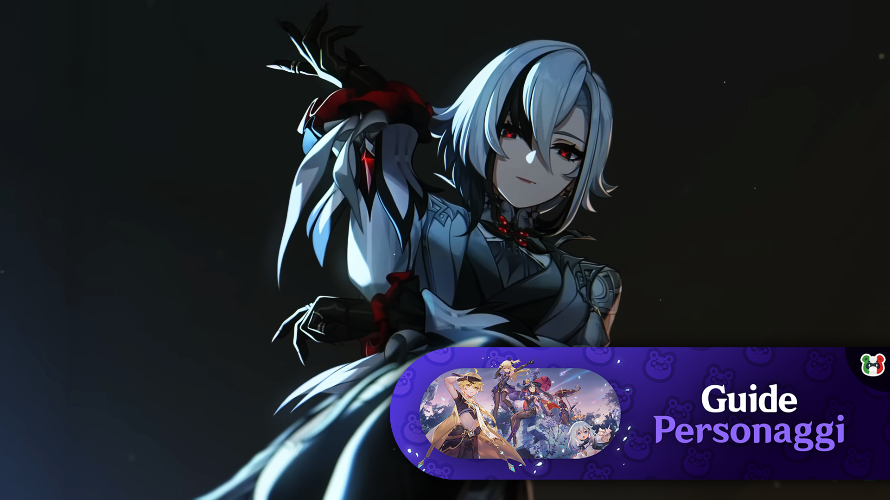

\
\
\

Nella versione 4.6 è stata finalmente rilasciata ***Arlecchino***, 5
stelle Polearm Pyro di \...Fontaine? In questa guida andremo a vedere
talenti, passive, costellazioni, armi, artefatti e team dove potrà
essere giocata!
\
Guida aggiornata alla versione **4.6**
\

# Talenti

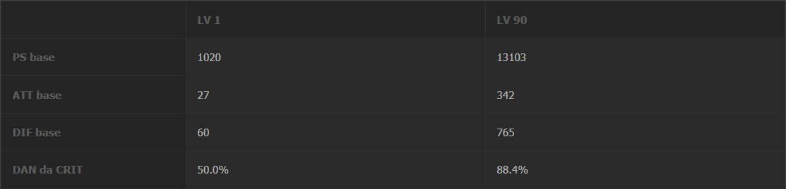

## Statistiche

Arlecchino ha delle **ottime** statistiche di base, con **elevato ATK
Base** e **Crit DMG** come bonus ascensione. Le **buone statistiche
difensive** sono **fondamentali** per permetterle di rimanere il
personaggio attivo **senza rischiare di morire** visto che, come vedremo
più avanti, **non può essere curata** mentre è **in combattimento**.

Prima di occuparci del resto del kit di Arlecchino, facciamo un breve
ripasso di **cosa sia un Bond of Life** (Legame Vitale), abbreviato per
comodità in **BoL**:

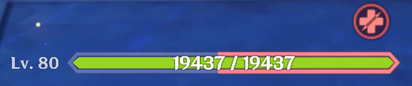

I BoL costituiscono un **debito di HP** che assorbe tutte **le cure in
ingresso** fino al suo esaurimento. Sostanzialmente **un BoL è**
**l\'opposto di uno scudo**.

> **Normal Attack: Invitation to a Beheading**

**Stupenda** stringa di **Normal Attacks** che costituisce la
**principale fonte di danno** all\'interno del kit. Se Arlecchino
possiede un **BoL** **pari o superiore** al **30% dei suoi HP**, entra
nello stato di **Maschera della Morte Rossa**:

In questo stato i suoi **Normal Attacks** (Attacchi Normali) vengono
**infusi di elemento Pyro**, infliggono **danno aggiuntivo in base al
BoL** da lei posseduto e **riducono di 0.8s** il **cooldown della
Elemental Skill** (Abilità Elementale). **Per ogni Normal Attack**
eseguito in questo stato, Arlecchino **consuma il** **7.5% del BoL da
lei posseduto**.

I Normal Attacks infusi applicano **1u Pyro** ed hanno **ICD Standard**
(**Internal Cooldown**, applicano Pyro **ogni 2.5s/3 Hit**), inoltre
**tenendo premuta** questa abilità è possibile **consumare stamina** per
eseguire uno **scatto speciale** della durata massima di **5s**.

> **Elemental Skill: All Is Ash**

Arlecchino infligge **danno Pyro AoE** (Area of Effect) e si lancia
contro il nemico per infliggere un **ulteriore colpo**, **marchiando**
tutti i nemici colpiti con una **Direttiva**. Le Direttive infliggono
**danno Pyro** ogni **5s**, fino ad un massimo di **2 attivazioni**.

Eseguendo un **Charged Attack** (Attacco Caricato) o la **Elemental
Burst** (Tripudio Elementale) le direttive saranno raccolte e
**convertite in BoL** pari al **65%** degli HP di Arlecchino. Il
quantitativo **massimo di BoL** ottenibile tramite questo metodo è pari
a **145%** ogni **35s**, **limite che viene resettato** ad ogni utilizzo
della Elemental Skill.

Questa abilità ha **cooldown** pari a **30s** e genera **5**
**particelle** **Pyro**.

> **Elemental Burst: Balemoon Rising**

Arlecchino **spiega una sua ala** ed infligge **danno Pyro AoE**,
**assorbendo** tutte le **Direttive** per **curarsi** e **resettando il
cooldown** della **Elemental Skill**.

Considerato che utilizzare questa abilità **costringe a ripetere il
setup** per ottenere BoL, **Arlecchino presenta una scelta** al
giocatore: **Curarsi e ricominciare**, oppure **accettare il rischio e
mantenere un più elevato livello di BoL**, permettendole quindi di
infliggere **più danno**.

Questa abilità costa **60 Energy** ed ha **cooldown** pari a **15s**.

> **A1: Agony Alone May Be Repaid**

Le Direttive di Arlecchino possiedono i seguenti **effetti aggiuntivi**:

-   Alla **morte** di un nemico **inflitto con una Direttiva**,
    Arlecchino ottiene un **BoL pari al 130% dei suoi HP**.
-   Una volta passati **5s dalla applicazione di una Direttiva**,
    quest\'ultima verrà trasformata in un **Debito**. Quando Arlecchino
    **assorbe un Debito**, esso verrà convertito in un **BoL pari al
    130% dei suoi HP**.

I **BoL** generati tramite questa passiva **non possono superare il
limite imposto dalla Elemental Skill**.

> **A4: Strength Alone Can Defend**

Arlecchino ottiene **1% Physical ed Elemental Resistance** per **ogni
100 punti di ATK oltre i 1000**, fino ad un **massimo** di **20%**.

> **Talento Esplorativo: The Balemoon Alone May Know**

Quando Arlecchino si trova **in combattimento**, ottiene **40% Pyro
DMG** e **può essere curata solamente tramite la sua Elemental Burst**.

> Rotazione

Vediamo ora la **rotazione** **ottimale** di Arlecchino:

Elemental Skill \> Support Setup \> Charged Attack \> Combo

Questa rotazione incorpora i **5 secondi necessari per attivare
l\'effetto della A4** e li utilizza per **attivare i buff offerti dal
resto del team**.

La **combo** utilizzata **non è particolarmente importante**, dato che
la maggior parte dei danni inflitti da Arlecchino sono caricati **nel
danno addizionale** della modalità **Maschera della Morte Rossa,** ma
personalmente consiglio:

-   **4N4D** (**4 volte** catene di **4 Normal Attack** seguiti da un
    **Dash**) per infliggere il **massimo danno possibile**.
-   **5N3D** (**5 volte** catene di **3 Normal Attack** seguiti da un
    **Dash**) per una **flessibilità maggiore** nello **schivare i colpi
    nemici**.

> Priorità di upgrade dei talenti

Normal Attacks \> Elemental Burst \> Elemental Skill

\

## Costellazioni {#Costellazioni dir="auto"}

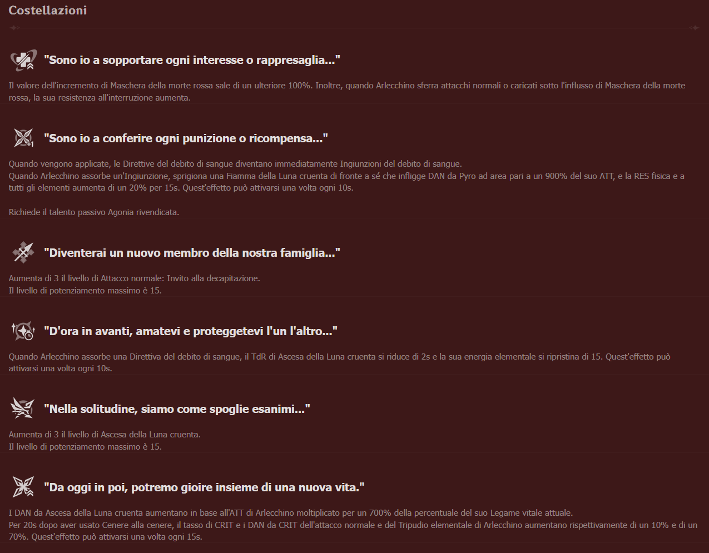

Le costellazioni di Arlecchino sono **molto forti**, in particolare tra
**C1 e C3**. Considerato che **C4 e C5 acquisiscono valore solo se si
possiede la C6**, il mio consiglio per i **low-spender** è di **fermarsi
massimo alla C3**.

> C1 - All Reprisals and Arrears Are Mine to Bear\...

Mentre Arlecchino è nello stato di **Maschera della Morte Rossa**, i
suoi **Normal Attacks ottengono Interrupt Resistance** (Resistenza alle
Interruzioni) ed il **moltiplicatore aggiuntivo** basato sul livello del
**BoL** **aumenta di 100%**.

Questa costellazione fornisce un aumento di dps del **27,87%**.

> C2 - All Rewards and Retribution, Mine to Bestow\...

Le **Direttive** evolvono **immediatamente** in **Debiti** e, ogni volta
che Arlecchino ne assorbe una, **infligge** **danno Pyro AoE** pari al
**900% del suo ATK** e guadagna **20% Physical ed Elemental Resistance**
per **15s**. Questo effetto è attivabile **1 volta ogni 10s**.

Questa costellazione fornisce un aumento di dps del **18,42%** e rende
**più flessibili le rotazioni**, permettendo di **saltare la finestra di
setup**.

> C3 - You Shall Become a New Member of Our Family\...

Incrementa di **3** il livello dei **Normal Attacks**.

Costellazione **incredibile**, fornisce un aumento di dps del
**30,24%**.

> C4 - You Shall Love and Protect Each Other Henceforth\...

Ogni volta che **Arlecchino assorbe una Direttiva**, ripristina **15
Energia** e **riduce di 2s** il **cooldown** della **Elemental Burst**.

Questa costellazione fornisce un aumento del dps dello **0%**, dato che
la **Elemental Burst viene utilizzata solo in caso si necessiti di
cure**.

> C5 - For Alone, We Are as Good as Dead\...

Incrementa di **3** il livello della **Elemental Burst**.

Questa costellazione fornisce un aumento di dps dello **0.0%** per la
**stessa ragione della C4**.

> C6 - From This Day On, We Shall Delight in New Life Together

Dopo **aver utilizzato la Elemental Skill**, il **Crit Rate** ed il
**Crit DMG** dei **Normal Attacks e della Elemental Burst** aumentano
rispettivamente del **10%** e del **70%**, inoltre il **modificatore
dalla Elemental Burst** aumenta di un valore pari al **700% del BoL da
lei posseduto**. Questo effetto ha **durata** pari a **20s** ed è
**attivabile ogni 15s**.

Questa costellazione fornisce un aumento di dps del **54.70%** e
permette di i**ncludere in modo stabile la Elemental Burst**
all\'interno della rotazione.

------------------------------------------------------------------------

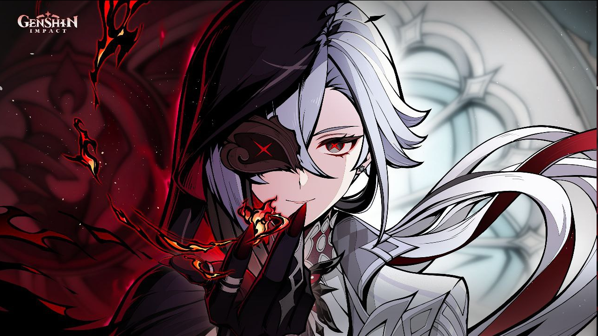

# Armi {#Armi dir="auto"}

In quanto **DPS** che scala su **ATK**, Arlecchino preferisce utilizzare
armi che le forniscono **Crit Rate**, **Crit DMG**, **ATK%, DMG%** e, se
giocata **all\'interno di team Vape**, **EM**.

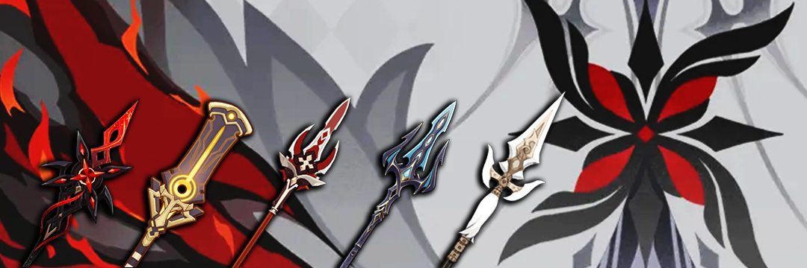

Guardiamo nel dettaglio **alcune delle armi raccomandate**:

-   ***Crimson Moon\'s Semblance***: **Regina sia per drip che per
    output**, è **la miglior arma** a disposizione di Arlecchino grazie
    ad una **stat-line solida** ed alla **passiva** che offre **BoL
    aggiuntivo e DMG%**.
-   ***Staff of Scarlet Sands***: **Stat-stick solido**, come
    **Primordial Jade Winged Spear** o **Staff of Homa**, ma che a
    differenza di queste ultime si distingue come **arma particolarmente
    competitiva all\'interno di team Vape**.
-   ***Deathmatch***: **Miglior 4 stelle** a disposizione di Arlecchino,
    purtroppo **l\'unico modo di ottenerla è il Battle Pass**.
-   ***Ballad of the Fjords***: Unica **4 stelle** in grado di **battere
    la Deathmatch** se usata in **team Vape** **che fanno uso della sua
    passiva**, purtroppo anche questa è ottenibile solo acquistando il
    **Battle Pass**.
-   ***White Tassel***: Arma **3 stelle** in grado di **dar filo da
    torcere a diverse 4**, è la **miglior arma F2P** di Arlecchino a
    patto di **includere Bennett all\'interno del team**.

Per la metodologia di calcolo e per qualsiasi informazione aggiuntiva
rimando al [Google
Sheet](https://docs.google.com/spreadsheets/d/1H0Ab71YxXXgJelxn2wHmLNULx_L4jxrSzQUmC16PaLk){target="_blank"}
realizzato da me.

------------------------------------------------------------------------

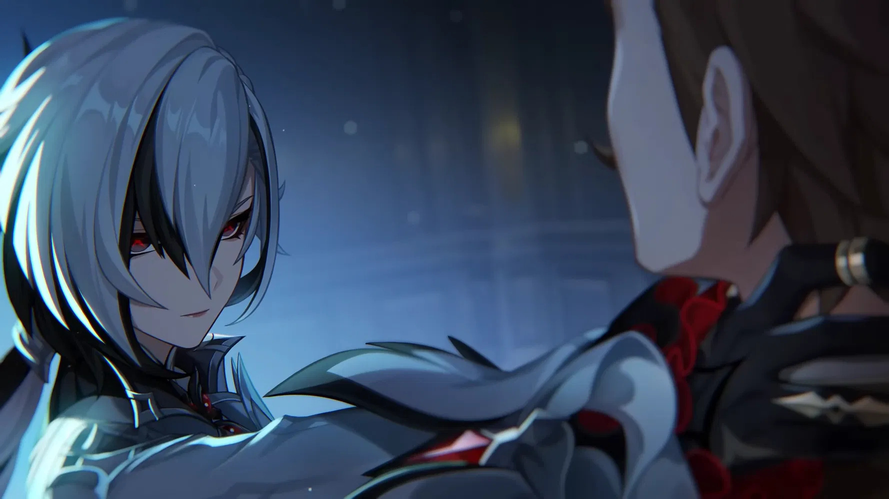

# Artefatti {#Artefatti dir="auto"}

Arlecchino ha accesso ad una **vasta gamma di set**, la cui **efficacia
non è però comparabile a quella del nuovo set** a lei dedicato.

### Fragment of Harmonic Whimsy

> ***2 Pezzi***: **ATK** **+18%**.

> ***4 Pezzi***: Il personaggio che equipaggia questo set guadagna **18%
> DMG** ad ogni **variazione del livello del BoL**. Questo effetto ha
> **durata pari a 6s** e può **stackare fino a 3 volte**.

**Di gran lunga il miglior set** a disposizione di Arlecchino, è stato
**creato appositamente per lei**. Considerato che anche questo set verrà
**rilasciato nella versione 4.6**, potrebbe volerci un po\' prima di
riuscire ad ottenerne un set completo dalla qualità accettabile. In tal
caso **può valer la pena valutare set alternativi**.

### Gladiator\'s Finale

> ***2 Pezzi***: **ATK** **+18%**.

> ***4 Pezzi***: Se il personaggio che equipaggia questo set fa uso di
> **Sword**, **Claymore** o **Polearm**, guadagna **35% Normal Attack
> DMG**.

**Secondo miglior set** a disposizione di Arlecchino, è utile come
**sostituto** in attesa di poter passare al set a lei dedicato.
Considerato che **esiste sin dalla versione 1.0** e che è **disponibile
nelle Strongbox**, è molto facile che voi **abbiate già un set pronto
all\'uso e di elevata qualità**.

### Gilded Dreams

> ***2 Pezzi***: **EM +80**.

> ***4 Pezzi***: Se il personaggio che equipaggia questo set **attiva
> una reazione elementale**, ottiene dei **buff** ad **ATK%** ed **EM**
> dipendentemente dalla **composizione del team**. Per ogni membro del
> team dello **stesso elemento** l\'utilizzatore guadagna **14% ATK**,
> mentre per ogni **alleato di elemento differente** guadagna **50 EM**.
> Questo effetto ha **durata pari ad 8s** ed è **attivabile ogni 8s**.

Opzione paragonabile a Gladiator all\'interno di **team Vape**, è
anch\'esso utile come sostituto in attesa di poter **passare ad un set
migliore**. Considerato che **esiste sin dalla versione 3.0** e che si
trova in un **dominio molto efficiente da farmare** è probabile che
**abbiate già un set pronto all\'uso**.\

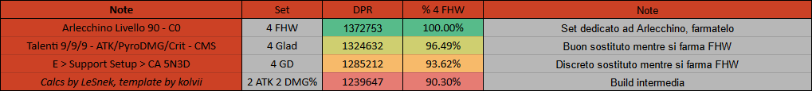

Per la metodologia di calcolo e per qualsiasi informazione aggiuntiva
rimando al [**Google
Sheet**](https://docs.google.com/spreadsheets/d/1H0Ab71YxXXgJelxn2wHmLNULx_L4jxrSzQUmC16PaLk){target="_blank"}
realizzato da me.

\

### Statistiche degli artefatti

**Indipendentemente dal set** utilizzato, le **main stat** degli
artefatti dovrebbero essere **ATK%** per la Sand, Pyro**DMG** per il
Goblet e **Crit** per il Circlet. È possibile valutare l\'utilizzo di
una **Sand EM** nel caso **si intenda giocare un team Vape** e non si
possieda sufficiente EM.\

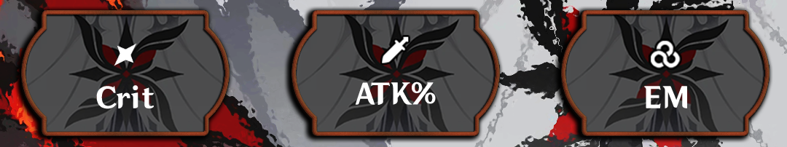

Per quanto riguarda invece le **sub stats**, priorità va data a **Crit
Rate**, **CritDMG** ed **ATK%**, mentre **EM** andrebbe **considerata
solo se si intende utilizzare un team Vape**.

------------------------------------------------------------------------

# Teams {#Teams dir="auto"}

Arlecchino è un DPS che **costruisce i propri moltiplicatori** tramite
**l\'accumulo di BoL** ad inizio rotazione per poi **consumarli** nel
corso di quest\'ultima. Questo rende il **profilo del suo danno molto
particolare**, con una porzione significativa del **danno concentrata ad
inizio combo**, e le offre la **possibilità di potenziare le rotazioni
successive** scegliendo di **mantenere il BoL** **piuttosto che
consumarlo per curarsi** tramite la Elemental Burst.

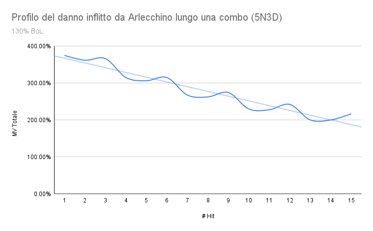

In altre parole, **il danno inflitto varia in funzione al livello di
BoL** da lei mantenuto e quindi il suo **output migliora** in modo
**significativo** nel momento in cui si è in grado di **uccidere i
nemici in poche hit**, risparmiando BoL per le rotazioni successive.

Da questo suo modo particolare di incrementare il suo output derivano
altre **particolarità da tenere in conto** mentre pensiamo a quale team
costruire intorno a lei:

-   Arlecchino, a differenza di Hu Tao, **non possiede steroidi per il
    proprio ATK** all\'interno del suo kit ed è quindi molto più
    **dipendente dal Buff di Bennett**.
-   **L\'abbondanza di DMG%** all\'interno del suo kit ed il fatto che i
    suoi **Normal Attack hanno ICD Standard** (2.5s/3 hit) la rendono
    leggermente **meno sinergica** con **Sucrose** e **Kazuha** rispetto
    ad altri DPS Pyro.
-   **L\'impossibilità di ricevere cure** mentre è in combattimento può
    crearle **problemi nell\'affrontare alcune tipologie di nemici**
    (e.g: Rifthounds, Segugi della Faglia) ed in generale la porta ad
    **apprezzare la presenza di uno Shielder** all\'interno del team.
-   All\'interno dei **team Vape** possiamo **evitare di preoccuparci di
    quali hit attiveranno la reazione** dato che la maggior parte del
    danno inflitto deriva da **Maschera della Morte Rossa** e non dal
    moltiplicatore del colpo.

\

### VV Vape

Il miglior team in termini di output, si concentra sul permettere ad
Arlecchino di eseguire **Vaporize** ed infliggere quanto più danno
possibile**.** Le **rotazioni compatte**, la **mancanza di Shielder** e
l\'**impossibilità di curare Arlecchino** rendono questo team uno per
giocatori dai **cuori forti e** le **mani fredde**, dato lo **scarso
margine di errore** concesso. Nel caso fosse necessaria qualche sorta di
**utilità difensiva** è possibile **sostituire Yelan o l\'unità Anemo
con Xingqiu**.

Vediamo ora un **esempio** di team così composto **in azione**:

\

### Petra Vape

Sicuramente il più comodo da giocare, **è una versione alternativa** del
team VV Vape che **sacrifica del danno** in cambio di **utilità
difensiva** offerta da uno Shielder. **Zhongli è la scelta migliore**
data la sua capacità di offrire una **vasta gamma di** **buff
offensivi** uniti allo **scudo più resistente** del gioco.

Vediamo ora un **esempio** di team così composto **in azione**:

\

### Overload

Altro archetipo a disposizione di Arlecchino, questo team **sfrutta i
buff offerti da Chevreuse** per potenziare il più possibile l\'output
delle unità **Pyro** ed **Electro**. Nel caso fosse necessaria qualche
sorta di **utilità difensiva** è possibile **sostituire Bennett con
Beidou**: quest\'ultima è in grado di fornire uno **scudo**,
incrementare la **resistenza alle interruzioni** e **mitigare i danni in
ingresso**, oltre che **apportare danni significativi** se ci si trova
ad affrontare un **numero moderato** di nemici.

Vediamo ora un **esempio** di team così composto **in azione**:

\

### MonoPyro

Un team che si concentra sull\'aumentare il **danno** inflitto dai
personaggi Pyro **senza doversi affidare a delle reazioni**. **Solido**,
anche se certamente non uno dei migliori team a sua disposizione.

Vediamo ora un **esempio** di team così composto **in azione**:

\

### Double Geo

Un team **Double Geo** si concentra sul **proteggere** il personaggio
on-field, **migliorarne l\'output** grazie alla **Risonanza Geo** e
supportarlo tramite discreto **danno da Off-Field**.

Dato che Arlecchino è in grado di infliggere quantità significative di
danni, questo **grande classico fatica ad imporsi** su altri team che si
concentrano solo sull\'offrirle buff. Rimane comunque una alternativa
nel caso **non si possiedano i supporti giusti** o semplicemente **siano
impiegati in un altro team**.

Vediamo ora un **esempio** di team così composto **in azione**:

------------------------------------------------------------------------

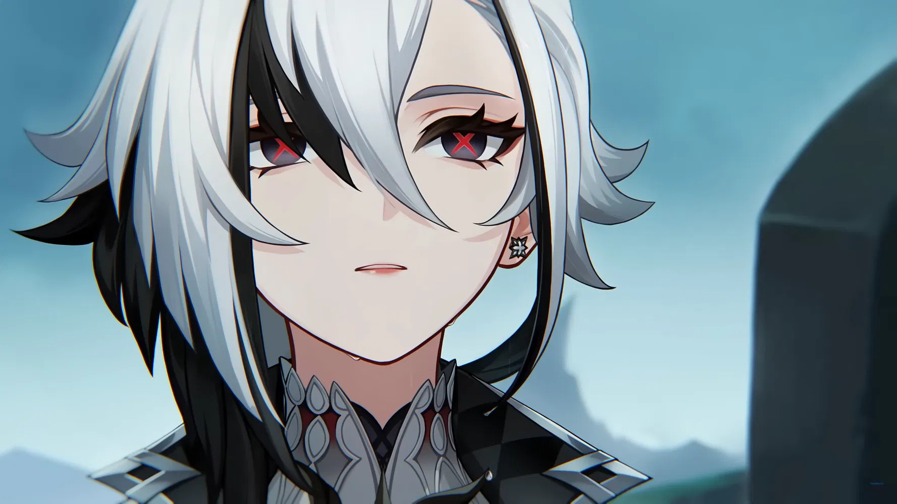

# Conclusione {#Conclusione dir="auto"}

Innanzitutto, se avete raggiunto questa sezione della guida, vi
ringrazio per l'attenzione. Cerchiamo di tirare le somme sullo stato di
Arlecchino:

> Arlecchino è un **ottimo DPS** che ha a sua disposizione una **vasta
> gamma di team** tra i quali scegliere, al costo di **non potersi
> curare** ed aver **difficoltà nell\'includere Shielder** al loro
> interno. Sicuramente **uno dei migliori DPS** **del gioco**,
> soprattutto se si decide di **investire verticalmente su di lei**.

#### ***Punti di forza***

-   La maggior parte del suo **danno è caricato ad inizio rotazione**,
    permettendole di **uccidere i nemici molto in fretta**.
-   **Maschera della Morte Rossa** le permette di **non curarsi di quale
    hit procchi le reazioni**, a differenza di altri Pyro DPS quali
    Yoimiya.
-   Pur dando il **meglio di sé all\'interno di team Vape**, può essere
    utilizzata con successo in altri team come **Overload**,
    **Overvape** o **Monopyro**. Sicuramente il **DPS Pyro più
    flessibile**.
-   **White Tassel** è un **ottima arma F2P**.
-   Ottima per esplorare dato che **l\'infusione Pyro può essere
    mantenuta all\'infinito** e che può essere **potenziata accumulando
    in anticipo BoL**.
-   Finalmente un\'**unità che premia l\'esecuzione meccanica del
    giocatore**.

#### *Criticità*

-   Essere costretti ad utilizzare la **Elemental Burst per curarsi**
    dopo aver subito un colpo la costringe a **resettare la rotazione**.
    **Skill Issue**.
-   **Includere Shielder all\'interno del team può risultare
    difficile**, specialmente **se non si possiede Zhongli**.
-   **Nonostante** **Arlecchino non possa essere curata** mentre si
    trova in combattimento, i suoi **migliori supporti**, Bennett e
    Chevreuse, sono **entrambi Healer**. Speriamo che Natlan possa
    finalmente fornirci uno **Shielder comparabile a Bennett\...**
-   Bennett può essere **molto pericoloso da utilizzare contro certi
    nemici** (e.g Hydro Tulpa) dato che **gli permette di far uso di
    reazioni elementali**.
-   **Le uniche** **armi 4 stelle competitive** sono **prigioniere del Battle
    Pass**.

# Bibliografia e sitografia

[@HoYoWiki,@Valendino2020,@Guoba]
