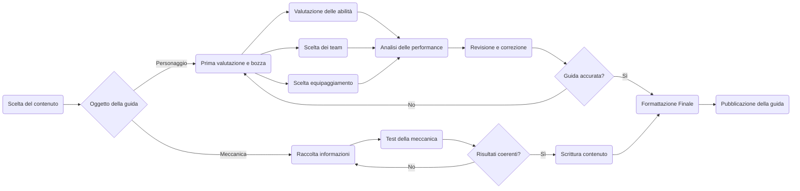

{width=300px height=300px}

# Il manuale dell'Avventuriero
Una serie di guide per vivere a pieno il vostro viaggio per Teyvat

## Introduzione

Collana di guide dedicata al mondo del videogioco Genshin Impact: Dalla storia di Teyvat fino alle meccaniche di  ed alle meccaniche del gioco Genshin Impact: dalle meccaniche di gioco fino alla 
*Obiettivi*, *tecnologie*, aspetti salienti del *flusso di gestione documentale*, *risultati* raggiunti.  

## Ideazione 

### Tema
La collana copre diversi aspetti del gioco, spaziando dal sistema di combattimento alla storia, rendendola adatta sia per principianti che per giocatori esperti.

- Esplorazione di Teyvat:
    - Lore: Approfondimenti sulla storia e sulla mitologia del mondo di gioco, con particolare enfasi sulle Pietre Divine.
    - Missioni: Approfondimenti sulle missioni principali, secondarie e walkthrough dettagliati su come ottenere tutti gli Achievement del gioco.
    \
- Sistema di combattimento:
    - Reazioni Elementali: Dettagli sul funzionamento delle reazioni elementali e su come sfruttarle in modo ottimale.
    - Composizione dei team: Consigli per creare squadre efficaci, sfruttando al massimo le reazioni elementali e le abilità dei personaggi.
    \
- Personaggi:
    - Personaggi: Analisi dettagliata dei personaggi giocabili comprensiva di team, costellazioni, armi, artefatti e team dove possono essere giocati.
    - Analisi del Meta: Analisi delle patch e delle perfomance dei vari personaggi giocabili per capire su quali personaggi conviene investire.
    \
- Sistemi di gioco:
    - Creazione di un account sicuro: La sicurezza è importante ed è ciò che ci permette di intraprendere questo viaggio senza alcun timore di perdere progressi.
    - Valute di gioco: Consigli per ottenere il massimo dalle valute di gioco.
    \

Le principali fonti di attenzione sono il rilascio di una nuova regione, l'uscita di personaggi ogni patch ed il rilascio della quest annuale che espande in modo significativo 

Questi temi garantiscono che la collana di guide resti interessante per una vasta gamma di giocatori nel corso nel tempo e che il suo contenuto scali con l'esperienza del giocatore.

### Destinatari
Descrivere i destinatari del prodotto editoriale descrivendo le personas alle quali si rivolge il prodotto. Descrivete alcuni scenari d'uso nei quali inserire le personas scelte come destinatari.

> LM2 slide 29-32

### Requisiti di accettazione
Indicate i requisiti di accettazione che dovranno essere soddisfatti per raggiungere i destinatari. Quali modelli di fruizione consideriamo più efficaci per i nostri destinatari? Quali standard consideriamo come riferimento? Quali aspetti di innovazione possiamo proporre? Nella qualità dei contenuti o nel processo di fruizione?

> LM4

### Canali di distribuzione
Presentare i canali di distribuzione che si intendono raggiugnere e i formati dati richiesti da ogni canale. Esempi di canali sono: (i) Web, (ii) Social, (iii) Market place, (iv) Intranet. Esempi di formati. (i) Word, (ii) ePub, (iii) CBZ, (iv) PDF, (v) WebBook. 
Proporre alcuni accenni relativi all'identità visuale e alle regole tipografiche o di stile che si intendono seguire. Nel settore esisto classi di documento standard? Dati gli obiettivi è importante trasmettere un senso di adesione a modelli già conosciuti o un senso di innovazione? Lo stile sarà orientato verso un'espressione formale o informale?

## Processo di Produzione

### Acquisizione dei contenuti
Descrivere le fonti che saranno utilizzate nella costruzione del prodotto editoriale. Nella scelta delle fonti valutare il costo di acquisizione: (i) disponibili come fonti libere, (ii) generabili automaticamente, (iii) richiedono un lavoro di redazione manuale.

### Gestione documentale

Descrivere il *flusso di gestione documentale* definito per il progetto. Ad esempio, (i) la raccolta o produzione dei contenuti, (ii) la valutazione dei diritti, (iii) la trasformazione dei formati, (iv) la strutturazione dei contenuti, (v) l'applicazione dello stile grafico, (vi) la generazione dei metadati, (vii) la distribuzione dei contenuti. Nella descrizione del flusso considerare le  fasi di revisione, controllo e approvazione che possono richiedere le diverse fasi.

> LM2 slide 14-26

### Tecnologie adottate

Descrivere le tecnologie addottate nelle diverse fasi e discuterne il contributo in termini di raggiungimento degli obiettivi descritti negli scenari d'uso.

|                |Scenario 1                          |Scenario 2                       |
|----------------|-------------------------------|-----------------------------|
|Markdown |`'Isn't this fun?'`            |'Isn't this fun?'            |
|XSLT       |`"Isn't this fun?"`            |"Isn't this fun?"            |
|ePud         |`-- is en-dash, --- is em-dash`|-- is en-dash, --- is em-dash|

### Esecuzione del flusso
Allegare, possibilmente attraverso il riferimento ad un repository documentale, i materiali, gli script, le configurazioni, che permettono di riprodurre il flusso di produzione documentale. I contenuti non devono necessariamente essere completi, può essere sufficiente fornire un prototipo per ogni tipologia di contenuto previsto e per ogni formato di destinazione previsto.  

## Valutazione dei risultati raggiunti

### Valutazione del flusso di produzione

Per valutare il contributo proposto valutare le diverse fasi del flusso in termini di (i) riduzione dei tempi di gestione documentale, (ii) riduzione degli errori, (iii) miglioramento della qualità dei documenti, (iv) miglioramento del livello di accettazione della tecnologia, (v) raggiungimento di nuovi canali di distribuzione, (vi) soddisfacimento di nuovi scenari d'uso.
 
### Confronto con lo stato dell'arte

Può anche essere utile confrontare una versione ASIS del flusso di gestione, senza la tecnologia o le innovazioni proposte, e una TOBE che include la tecnologia e le innovazioni proposte dallo studente.

### Limiti emersi

È importante sottolineare i limiti emersi. Come l'impossibilità di accesso ad alcune tecnologie o fasi del flusso di gestione documentale, limiti nella automazione di alcune passi di trasformazione dei formati o di integrazione delle sorgenti

## Conclusioni

Discutere i risultati ottenuti, verificando se gli obiettivi definiti dai casi d'uso siano pienamente o parzialmente raggiunti. Evidenziare gli aspetti nei quali si sono raggiunti i risultati più soddisfacenti e le limitazioni emerse.

## Bibliografia e sitografia

Elencare i riferimenti bibliografici e risorse online che hanno maggiormente contribuito alla realizzazione del progetto. Ad esempio [@sechi2010,@pantieri2021,@ceravolo2023]
