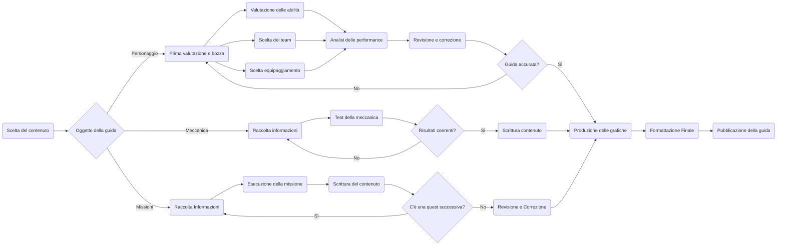

# Il manuale dell'Avventuriero
Una guida per vivere a pieno il vostro viaggio per Teyvat

## Introduzione

Guida dedicata al mondo del videogioco Genshin Impact: Dalla storia di Teyvat fino alle meccaniche di gioco, un'analisi completa del videogioco.
L’obiettivo è quello di fornire una guida affidabile e completa, in grado di essere aggiornata in tempi rapidi grazie a Pandoc e Git. 

\
\

## Ideazione 

### Tema

La collana copre diversi aspetti del gioco, spaziando dal sistema di combattimento alla storia, rendendola adatta sia per principianti che per giocatori esperti.

- Esplorazione di Teyvat:
    - Lore: Approfondimenti sulla storia e sulla mitologia del mondo di gioco, con particolare enfasi sulle Pietre Divine.
    - Missioni: Approfondimenti sulle missioni principali, secondarie e walkthrough dettagliati su come ottenere tutti gli Achievement del gioco.
    \
- Sistema di combattimento:
    - Reazioni Elementali: Dettagli sul funzionamento delle reazioni elementali e su come sfruttarle in modo ottimale.
    - Composizione dei team: Consigli per creare squadre efficaci, sfruttando al massimo le reazioni elementali e le abilità dei personaggi.
    \
- Personaggi:
    - Personaggi: Analisi dettagliata dei personaggi giocabili comprensiva di team, costellazioni, armi, artefatti e team dove possono essere giocati.
    - Analisi del Meta: Analisi delle patch e delle perfomance dei vari personaggi giocabili per capire su quali personaggi conviene investire.
    \

Le principali fonti di attenzione sono il rilascio di una nuova regione, l'uscita di personaggi ogni patch ed il rilascio della quest annuale che espande in modo significativo la trama del gioco. I temi presenti nella guida garantiscono che questa resti interessante per una vasta gamma di giocatori nel corso nel tempo e che il suo contenuto scali con l'esperienza del giocatore.
\

### Destinatari

Il prodotto si rivolge a tutti gli appassionati di Genshin Impact offrendo loro guide dettagliate e risorse utili in base alla loro esperienza con il titolo.

1. Persona: Luca, giocatore principiante

    - Nome: Luca
    - Età: 19 anni
    - Occupazione: Studente universitario
    - Stile di vita: Divide il suo tempo tra gli studi universitari ed il gaming, hobby al quale si dedica spesso la sera o nei weekend e che usa per rilassarsi.
    - Interessi: Viaggi, social media, serie TV, videogiochi.
    - Esperienza: Ha iniziato a giocare da un mese
    - Motivazione: Luca ha da poco scoperto Genshin Impact, attirato dalla similitudine ad altri titoli da lui giocati, ma si sente sopraffatto dalla complessità delle meccaniche di gioco e dalla quantità di contenuti.
    - Casi d'uso della guida:
        - Durante un combattimento Luca si ritrova contro un nemico al quale non riesce in alcun modo ad infliggere alcun danno. Messo in pausa il gioco, Luca consulta la guida e scopre cosa sono e come funzionano gli scudi elementali.
        - Luca apre la mappa del gioco e, in alto a destra, vede una strano contatore di "resina".
        - Luca ha appena ottenuto un nuovo personaggio ma non sa nè come usarlo nè in quali team inserirlo. Non volendo perdere tempo a testarlo lui stesso apre la guida e decidere di usare uno dei team lì riportati.

2. Persona: Sofia, giocatrice esperta

    - Nome: Sofia
    - Età: 26 anni
    - Occupazione: Streamer part-time
    - Stile di vita: Streamma regolarmente su Twitch, condividendo le sue strategie e analisi con una piccola ma crescente base di follower.
    - Esperienza: Giocatrice da oltre tre anni, AR 60
    - Motivazione: Sofia è una giocatrice appassionata e vuole affrontare le sfide più difficili offerte dal gioco. È sempre alla ricerca di nuove build o strategie per ottenere il massimo dai suoi team.
    - Casi d'uso della guida:
        - Sofia sta preparando un'analisi per il suo pubblico e le servono informazioni precise sul funzionamento e danno inflitto dalle reazioni elementali. Consultando la guida recupera le formule di ciascuna reazione.
        - Sofia ha visto che è appena uscito un nuovo personaggio ma non ha modo di testarlo lei stessa, consultando la guida può formare una prima opinione su di esso.
        - 
        Condividere le sue scoperte con la community attraverso il suo canale streaming.

### Requisiti di accettazione

1. Utilità percepita
    - I giocatori percepiscono che la guida li aiuterà a migliorare nel gioco, ottimizzare le loro build, completare le missioni più velocemente ed ottenere ricompense migliori.
    - Informazioni dettagliate su ogni aspetto del gioco
    \
    Risultato Atteso: I giocatori possono risparmiare tempo e risorse seguendo la guida.

2. Facilità d'uso percepita
    - La guida offre soluzioni pratiche e facilmente applicabili.
    - Il linguaggio utilizzato nella guida è chiaro e comprensibile.
    - La struttura della guida è simile a quella di altro contenuto ufficiale e fan-made, rendendola molto facile da utilizzare.
    \
    Risultato Atteso: Gli utenti possono rapidamente trovare le informazioni di cui hanno bisogno.

3. Atteggiamento verso l'uso
    - Feedback positivo sulla chiarezza e utilità delle informazioni fornite.
    - Esperienza d'uso positiva che incoraggia a utilizzare la guida regolarmente.
    \
    Risultato Atteso: I giocatori sviluppano un atteggiamento favorevole nei confronti della guida, considerandola uno strumento essenziale per migliorare la propria esperienza di gioco.

4. Intenzione comportamentale d'uso
    - Essendo Genshin un Live Service Game sarà soggetto a molteplici aggiornamenti, ciascuno dei quali darà ragione di consultare la guida per scoprire tutte le novità del gioco e rimanere al passo con il gioco.
    \
    Risultato Atteso: I giocatori esprimono l'intenzione di continuare a utilizzare la guida per supportare la loro esperienza di gioco.

5. Uso effettivo
    \
    Risultato Atteso: I giocatori utilizzano la guida in modo regolare per ottimizzare le loro scelte in gioco, dalle build ai team fino all'esplorazione.

I giocatori sono abituati a fruire di contenuto di questo tipo sotto forma di guida estesa reperibile in rete con al suo interno risorse complementari quali immagini o video, modalità verso la quale hanno spinto sia la casa di sviluppo sia la community internazionale del gioco. 
Data questa situazione è possibile innovare nei contenuti, spingendo verso un'analisi quantitativa piuttosto che qualitativa, spiccando per la qualità del prodotto offerto piuttosto che per una nuova modalità di fruizione.

### Canali di distribuzione

Il progetto sarà distribuito attraverso diversi canali:

- Forum della azienda produttrice
    Piattaforma web dedicata alla discussione del gioco offerta dalla casa produttrice, è integrata con il gioco e direttamente accessibile a partire da quest'ultimo. Il formato adottato per questo canale è Markdown per via del supporto offerto dalla piattaforma e per via della sua semplicità di utilizzo.
\
- Social Media
    Post su social media come Instagram, Tik Tok e Facebook permettono di raggiungere velocemente la maggior parte del pubblico attivo ed interessarlo alla lettura della guida. Il formato adottato sono immagini riassuntive JPG che permettono di illustrare le novità in modo rapido.
\
- Sito web della guida
    Piattaforma web dedicata al progetto, il formato adottato in questo caso è HTML.

\
Pur non esistendo regole tipografiche o identità visuali caratteristiche il prodotto si atterrà al formato ed allo stile già affermatosi all'interno della community internazionale del gioco per contenuto di questa natura ma con qualche novità per quanto riguarda la veste grafica. Lo stile del testo sarà informale ma professionale, orientato a facilitare la comprensione e l’engagement da parte dei giocatori senza scendere in tecnicismi eccessivi, ove possibile.

## Processo di Produzione

### Acquisizione dei contenuti

Le principali fonti utilizzate per la costruzione del prodotto sono i dati del gioco, reperibili all'interno dello stesso o dalla Wiki ufficiale del gioco [HoYoWiki](https://wiki.hoyolab.com), entrambi disponibili come fonti libere dietro pagamento di un compenso alla società se usate a scopo di lucro. 
Altre fonti sono invece ottenute a seguito di un lavoro di redazione manuale, come ad esempio le analisi dei singoli personaggi, vanno elaborate di volta in volta sulla base di quanto appreso dalle altre fonti e non sono automatizzabili.

### Gestione documentale

La valutazione dei diritti non è contemplata all'interno del flusso di gestione documentale in quanto il progetto opera con fonti libere dietro il pagamento di un compenso alla società in caso di utilizzo a scopi di lucro.
\

### Tecnologie adottate

Descrivere le tecnologie addottate nelle diverse fasi e discuterne il contributo in termini di raggiungimento degli obiettivi descritti negli scenari d'uso.

|                |Scenario                         |Contributo                      |
|----------------|-------------------------------|-----------------------------|
|Markdown | Qualunque scenario | `linguaggio di markup utilizzato per la scrittura del contenuto della guida.`|
|Pandoc| |Conversione automatizza           |
|Mermaid        | |-- is en-dash, --- is em-dash|
|Git        |  |-- is en-dash, --- is em-dash|

### Esecuzione del flusso

[Link alla repo](https://github.com/RafVale/Progetto-Editoria-Digitale/)

## Valutazione dei risultati raggiunti

### Valutazione del flusso di produzione

- L'uso di strumenti come Markdown e Pandoc permette di ridurre significativamente il tempo richiesto per la stesura dei documenti semplificando la gestione documentale e garantendo l'omogeneità dei risultati tra vari formati.
- Git permette di recuperare da qualsiasi errore durante la creazione del contenuto semplicemente tornando alla versione precedente del documento, garantendo che i progressi non vadano perduti.
- Mermaid permette di includere grafici interattivi, riducendo il tempo necessario ad elaborare un contenuto e migliorandone la qualità.
- L'uso di formati comuni permette la fruizione del prodotto su una vasta gamma di dispositivi.

L'adozione di questo flusso di produzione risponde in pieno alla necessità di semplificare il più possibile il processo di creazione del contenuto, già gravato dalla ricerca e dal lavoro necessario per le grafiche, garantendo al contempo l'assenza di errori.

### Confronto con lo stato dell'arte

L'uso del flusso di produzione permette di lavorare in modo collaborativo senza dover temere l'assenza di versioning e permette di evitare errori ed incongruenza tipiche delle guide aggiornate manualmente.
Può anche essere utile confrontare una versione ASIS del flusso di gestione, senza la tecnologia o le innovazioni proposte, e una TOBE che include la tecnologia e le innovazioni proposte dallo studente.

### Limiti emersi

- Markdown permette di semplificare significativamente la scrittura del testo della guida, soprattutto se utilizzato insieme ad un CSS che permetta di formattare il documento, ma richiede comunque di creare uno stile per LaTeX nel caso si intenda esportare in PDF visto che CSS è applicato solo ad output HTML.
- La versione offline del documento soffre di interattività ridotta visto che alcune risorse fanno uso della rete, come ad esempio l'embed di video.

## Conclusioni

Il progetto ha, in generale, raggiunto i suoi obbiettivi offrendo un'esperienza migliorata nella gestione documentale, nella qualità del contenuto e nella velocità di creazione di formati per la distribuzione multi-canale.
Al netto di alcune limitazioni, in particolare per quanto riguarda l'interattività off-line, c'è un evidente miglioramento nella velocità alla quale si riesce a produrre un contenuto data la significativa riduzione del tempo necessario per la corretta formattazione del testo.

## Bibliografia e sitografia

[@HoYoWiki,@Valendino2020]
